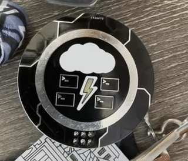
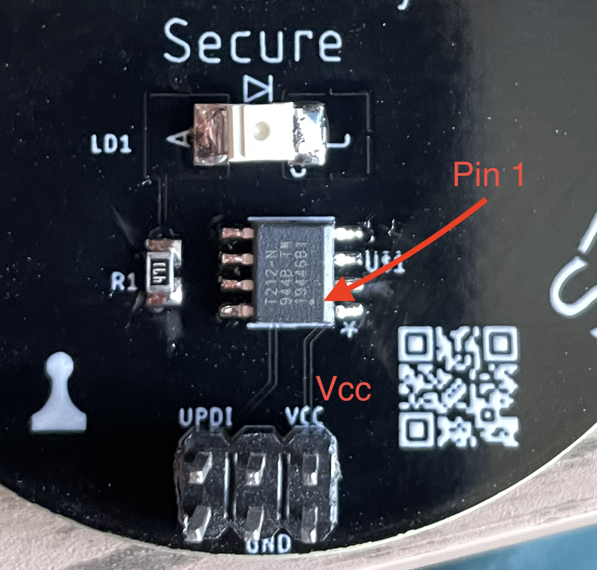
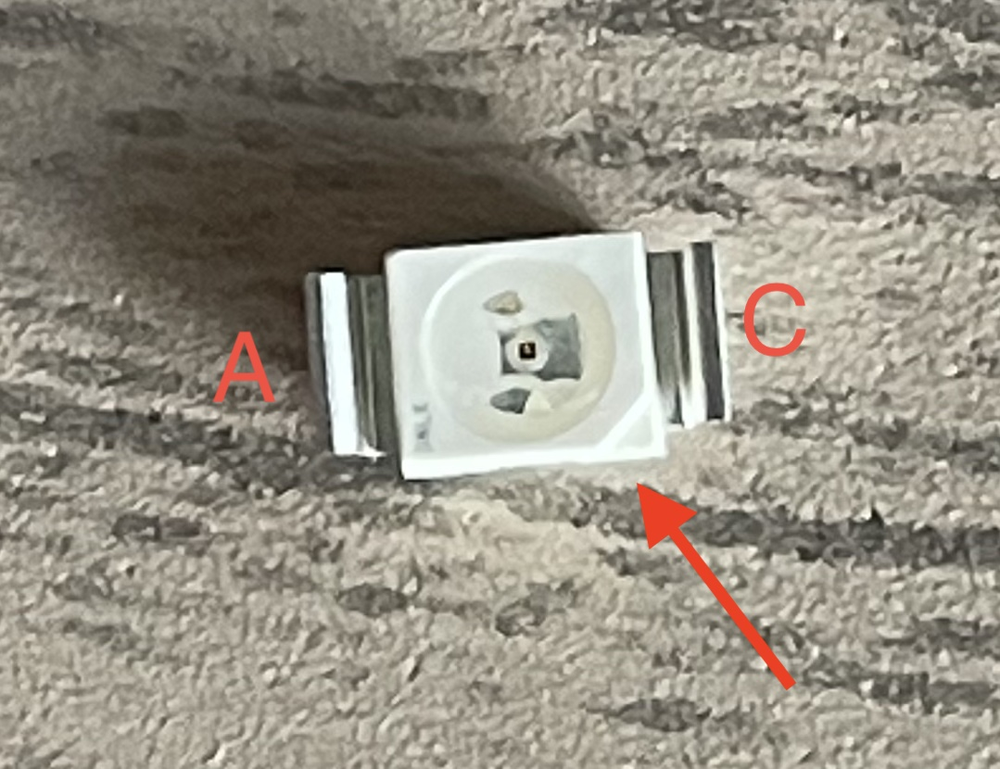
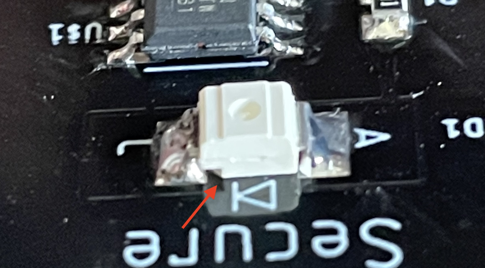
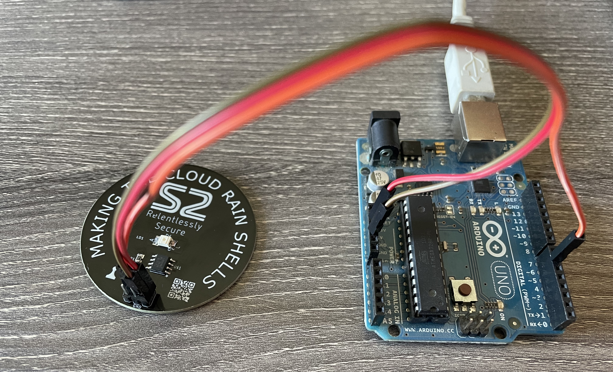

# S2 Raining Shells Coin
S2 Making the cloud rain shells coin / SAO 

### From [Stage 2 Security](https://www.stage2sec.com/)

# The coin can be converted to an SAO mini badge!


## Assembly

The following components are required to make the badge, in total they cost around $1
* [ATTINY212](https://www.digikey.com/en/products/detail/microchip-technology/ATTINY212-SSF/9947538)
* [470 Ohm 0805 Resistor](https://www.digikey.com/en/products/detail/panasonic-electronic-components/ERJ-UP6F4700V/8134838?s=N4IgTCBcDaIKICUBSBaAqgBQGwDEAsA7AAxEBqIAugL5A)
* [Reverse Mount Yellow LED](https://www.digikey.com/en/products/detail/vishay-semiconductor-opto-division/VLRE31R1S2-GS08/4073921?s=N4IgTCBcDaIGoBkBKBRAzARiRgymAtAOI4AMAHCALoC%2BQA)
* [2x6 2.54 pinheader](https://www.digikey.com/en/products/detail/amphenol-icc-fci/861400062YO2LF/4406000)

Solder each of the components onto the back of the coin as shown. Note the pin 1 location of the ATTiny is in the bottom right. The LED Cathode marking is on the underside of the LED, see the images below for proper placement.  Orientation of the resistor is not important. 




## Programming

The coin is programmed using the UPDI interface. The can be done using an Arduino as the programer. To do this you need to complete the following steps:
1. Follow the directions here to setup the Arduino https://github.com/SpenceKonde/AVR-Guidance/blob/master/UPDI/jtag2updi.md
2. Install the ATTiny boardmanager by following the instruction at https://github.com/SpenceKonde/megaTinyCore/blob/master/Installation.md#boards-manager-installation (Just the Boards Manager Installation section)
3. Open the s2_coulds.ino included in this repo, and use these settings for the project:
   * Board: 8-pin ATtiny412/402/212/202
   * Chip: ATtiny212
   * Programmer: "jtag2updi" 
4. Wire the Arduino to the coin in the following configuration: 

   Arduino | S2 coin
   ------- | -------
   5V | Vcc (top right)
   GND | GND (bottom right)
   PIN 6 | UPDI (top left) 
5. Set the bootloader on the coin ("Tools" -> "Burn bootloader")
5. Upload the sketch to the coin. NOTE: If you get the following errors the process still worked and they can be ignored.
```
avrdude: jtagmkII_getsync(): sign-on command: status -1
avrdude: jtagmkII_initialize(): Cannot locate "flash" and "boot" memories in description
```

I'm sure I've missed some important detail so feel free to ping me and let me know, enjoy!
